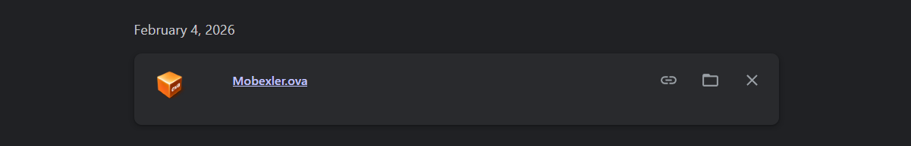
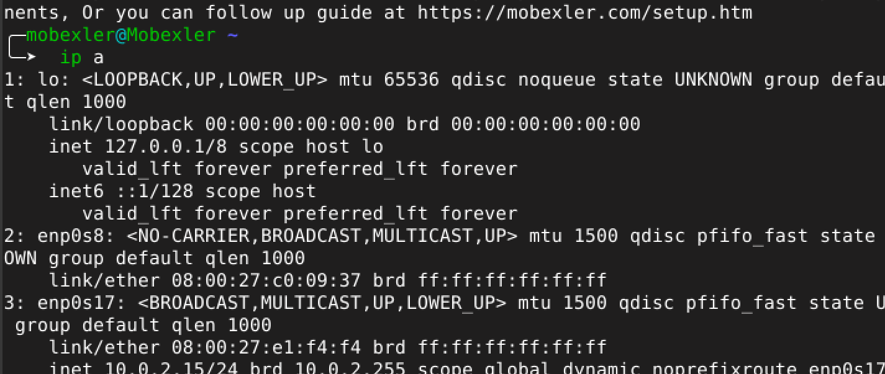
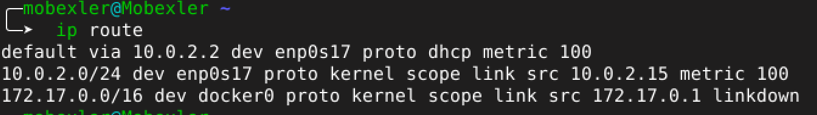
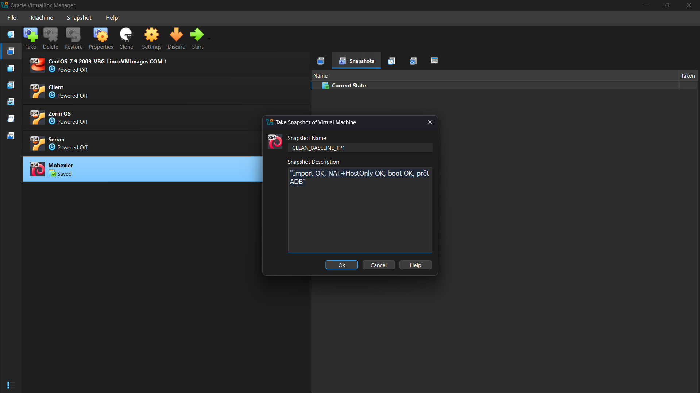
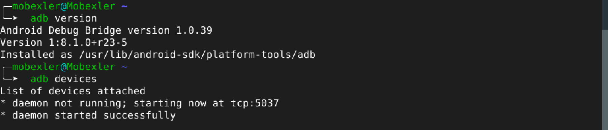
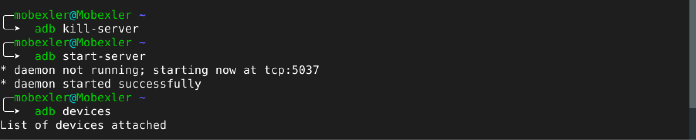

# Lab_1_MobileSecurity

Étape 1 — Téléchargement de Mobexler (OVA)

Le fichier Mobexler.ova a été téléchargé depuis le lien officiel (Google Drive).

(Optionnel) Le SHA256 a été calculé et comparé à la valeur fournie.

Résultat : le fichier est présent et prêt pour l’import :

Étape 3 — Premier démarrage + connexion

Mobexler a été démarré.

Connexion effectuée avec le mot de passe : mobexler.

Si un nom d’utilisateur était demandé, essai avec mobexler ou l’utilisateur affiché à l’écran.

Résultat : accès au bureau ou au terminal.

Étape 4 — Vérification du réseau (tests)

Vérification des interfaces et des IP :

Vérification de la route par défaut :

Test de connexion Internet (IP + DNS) :

Étape 5 — Snapshot “CLEAN” (VirtualBox)

Un snapshot a été créé après vérification du bon fonctionnement de Mobexler (boot + réseau OK).

Dans VirtualBox : VM → Snapshots → Take

Nom du snapshot : CLEAN_BASELINE_TP1

Description : Import OK, NAT+HostOnly OK, boot OK, prêt ADB

Résultat : snapshot visible (restauration possible si besoin).

Capture à ajouter : fenêtre Snapshots avec CLEAN_BASELINE_TP1.

Étape 6 — Préparer Android (Option A : USB, VirtualBox)

USB debugging a été activé sur le téléphone :
Paramètres → À propos → “Build number” x7 → Developer options → USB debugging ON

Le téléphone a été connecté à la VM via VirtualBox :
Devices → USB → (sélectionner le téléphone)

Vérification Android Debug Bridge (ADB) dans Mobexler :

Résultat attendu : le téléphone apparaît en device.

Dépannage rapide :

unauthorized → accepter la popup RSA sur le téléphone

rien n’apparaît → vérifier USB dans VirtualBox puis :

